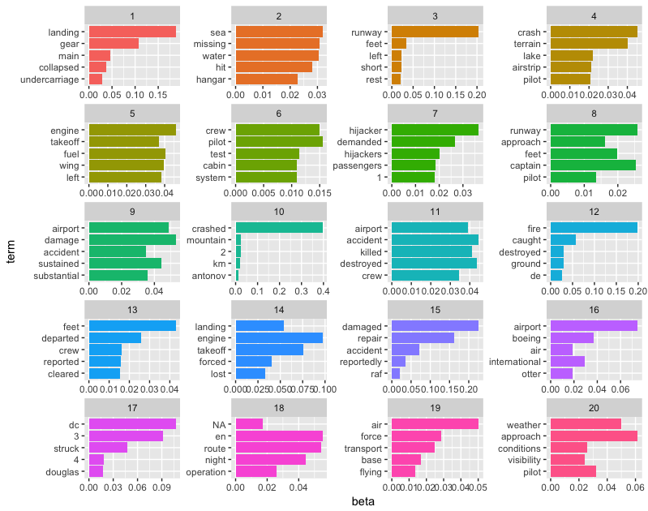

<div align="center">

</div>

> <p dir="RTL"> 
در این پروژه رخدادهای امنیت پروازها از سال ۱۹۱۹ تا کنون را بررسی می کنیم.
</p>

***
<p dir="RTL">
توضیحات نحوه ی جمع آوری داده ها و پاکسازی آن در فایل 
report.pdf 
آمده است. همچنین در فاز پیشین تحلیل مکاشفه ای بر روی داده ها صورت گرفته و به سوالات ۱ و ۶ و ۷ پاسخ داده شده بود.
<br>
داده های ذخیره شده از طریق لینک زیر قابل دسترسی است:
<br>
https://github.com/Ajal88/DA_Project
</p>
***
<p dir="RTL">
**کتابخانه های مورد نیاز و بارگذاری داده ها**
<br>
</p>

```{r, message=FALSE, warning=FALSE, comment=NA}
library(readr)
library(dplyr)
library(stringr)
library(highcharter)
library(ggplot2)
library(stringr)
library(topicmodels)
library(tidytext)

casn <- readr::read_csv("Data/asn_c.csv") %>% as.data.frame(stringsAsFactors = F) %>% 
  mutate(Total_occupants = ifelse(Total_occupants == 0 & Total_fatalities != 0, Total_fatalities, Total_occupants),
         Total_survivors = abs(Total_occupants - Total_fatalities)) %>% 
  mutate(Total_survivors = ifelse(Total_survivors > Total_occupants, Total_occupants, abs(Total_occupants - Total_fatalities))) %>% 
  mutate(is_army = str_detect(Operator, regex("Force|Navy",ignore_case = T))) %>% 
  mutate(occ_no = row_number())
```

***
<p dir="RTL">
۱. آنالیز متن و دسته بندی علت وقوع مشکلات پرواز ها
</p>

<p dir="RTL">
برای این منظور می خواهیم از مدل
lda 
استفاده کنیم. به همین دلیل ابتدا از داده های اصلی
تنها شماره ی تصادف و 
Narrative 
را انتخاب می کنیم. سپس علت سقوط را به کلمات آن تبدیل می کنیم و 
stopwords 
را از آن حذف می کنیم. سپس کلمات رایج در سقوط هواپیما همچون هواپیما و پرواز را از کلمات حذف می کنیم. در نهایت نیز تعداد تکرار هر لغت را برای هر 
Narrative 
بدست می آوریم. سپس از آنجایی که 
LDA 
با 
DocumentTermMatrix 
کار می کند، ساختار داده ی خود را به این صورت تغییر می دهیم. در نهایت نیز مدل خود را با ۲۰ 
topic 
لرن می کنیم. از آنجایی که لرن مدل وقت گیر است، مدل را برای استفاده ی آینده ذخیره می کنیم.
</p>
```{r, message=FALSE, warning=FALSE, comment=NA}
cause <- casn %>% select(occ_no, Narrative)

# split into words
cause_word <- cause %>%
  unnest_tokens(output = word, input = Narrative)

# plane stopwords
word = c("aircraft", "airplane", "plane", "flight")
plane_stop_words = data_frame(word)

word_counts <- cause_word %>%
  anti_join(stop_words) %>%
  anti_join(plane_stop_words) %>%
  count(occ_no, word, sort = TRUE)

flight_dtm <- word_counts %>%
  cast_dtm(occ_no, word, n)
```

```{r, message=FALSE, warning=FALSE, comment=NA, eval=FALSE}
accident_lda <- LDA(flight_dtm, k = 20, control = list(seed = 1234))
saveRDS(accident_lda, file="Data/lda.rds")
```

```{r, message=FALSE, warning=FALSE, comment=NA}
accident_lda = readRDS(file="Data/lda.rds")
```

<p dir="RTL">
سپس برای هر 
topic 
پنج کلمه ای که بیشترین احتمال حضور در این موضوع دارد را نمایش می دهیم.
</p>

```{r, message=FALSE, warning=FALSE, comment=NA}
accident_topics <- tidy(accident_lda, matrix = "beta")

top_terms <- accident_topics %>%
  group_by(topic) %>%
  top_n(5, beta) %>%
  ungroup() %>%
  arrange(topic, -beta)
```

```{r, message=FALSE, warning=FALSE, comment=NA, eval = FALSE}
top_terms %>%
  mutate(term = reorder(term, beta)) %>%
  ggplot(aes(term, beta, fill = factor(topic))) +
  geom_col(show.legend = FALSE) +
  facet_wrap(~ topic, scales = "free", nrow = 5) +
  coord_flip()
```
<div align="center">

</div>
```{r, message=FALSE, warning=FALSE, comment=NA}
top_terms_merge <- top_terms %>% group_by(topic) %>% summarise(words = paste(term, collapse=", "))

knitr::kable(top_terms_merge)
```

***
<p dir="RTL">
۲. رتبه بندی علت وقوع مشکلات برای پرواز ها
</p>

<p dir="RTL">
برای این بخش احتمال هر تاپیک برای هر سند را بدست می آوریم.
(gamma)
سپس تاپیکی که بیشترین احتمال را داراست به عنوان موضوع سند انتخاب می کنیم. سپس پروازها را بر اساس تاپیک دسته بندی کردی و تعداد رخدادهای امنیتی هر تاپیک را بدست می آوریم. نمودار علت سقوط پروازها بر اساس تعداد تکرار به صورت زیر است:
</p>

```{r, message=FALSE, warning=FALSE, comment=NA}
accidents_gamma <- tidy(accident_lda, matrix = "gamma")

accidents_data <- accidents_gamma %>% group_by(document) %>% 
  top_n(1, gamma) %>%
  ungroup()

accident_summary <- accidents_data %>% group_by(topic) %>% summarise(count = n()) %>% 
  arrange(desc(count))

accident_summary <- accident_summary %>% inner_join(top_terms_merge, by = c("topic"))

occurance_sum = sum(accident_summary$count)
accident_summary <- accident_summary %>% mutate(count_percent = 100*count/occurance_sum)

knitr::kable(accident_summary %>% select(-count_percent))

accident_summary %>% arrange(topic) %>% 
  hchart(type = "pie", hcaes(x = words ,y = count_percent)) %>% 
  hc_yAxis(title = list(text = "Count")) %>% 
  hc_xAxis(title = list(text = "Topic")) %>% 
  hc_title(text = "Airsafety Occurance Based on Topic", style = list(fontWeight = "bold")) %>% 
  hc_add_theme(hc_theme_538())
```

***
<p dir="RTL">
۳. آیا در صورت سقوط پرواز یک ایرلاین، دیگر نباید با آن پرواز کنیم؟
</p>

<p dir="RTL">
برای این سوال از دادههای حاوی میزان مسافت پرواز و ظرفیت هواپیما بهرهبردیم و شاخص 
ASK
را برابر میزان صندلی دردسترس کلیومتر قرار دادیمایم وشاخص یک میلیون برابر را اعمال کردهایم.
همانطور که از شکل و نتیجهی تست برای میزان مرگ و میر بدستآمده نمیتوان از میزان کشتههای یک شرکت هواپیمایی در سوانح هوایی آن پیش بینیای برای سالهای آیندهی آن انجامداد و نمیتوان دلیلی برای سفرنکردن با آن شرکت درنظر گرفت اما حوادث به صورت کلی رابطه دارد با میزان حوادثی که در گذشتهی آن شرکت رخ داده، واین رابطه رابطهایست مستقیم که از نتیجهای تست و نمودار نیز مشخص است و میتوان نتیجهگرفت که شرکتی که حوادث بیشتری را تجربهکردهاست در آینده نیز حوادث بیشتری را تجربهخواهد کرد و سفر با آن شرکت هواپیمایی ریسک بالاتری خواهدداشت.
میتوان این اتفاق را به سیاستگذاری و مدیریت هواپیمایی مربوط دانست.
</p>

```{r, message=FALSE, warning=FALSE, comment=NA}
airline_safety = read_csv("Data/airline_safety.csv") %>% 
  mutate(death_ask_85_99 = (fatalities_85_99/avail_seat_km_per_week)*10^6,
         death_ask_00_14 = (fatalities_00_14/avail_seat_km_per_week)*10^6)

ggplot(airline_safety, aes(x = death_ask_85_99, y = death_ask_00_14)) +
  geom_point() + 
  geom_text(aes(label=ifelse(death_ask_00_14>0.4 | death_ask_85_99>0.4,as.character(airline),'')),
            hjust=-0.1,
            vjust=-0.1,
            angle=10,
            size=3) +
  scale_x_continuous(name="Death in 1985 - 1999 ASK", limits=c(0, 1.2)) +
  scale_y_continuous(name="Death in 2000 - 2014 ASK", limits=c(0, 1)) + 
  geom_smooth(method = lm, se = FALSE) + 
  ggtitle("Fatalities of Companies")
  
cor.test(airline_safety$fatalities_85_99, airline_safety$fatalities_00_14)

ggplot(airline_safety, aes(x = incidents_85_99, y = incidents_00_14)) +
  geom_point() + 
  geom_text(aes(label=ifelse(incidents_00_14>10 | incidents_85_99>20,as.character(airline),'')),
            hjust=0,
            vjust=0,
            angle=10,
            size=3) +
  scale_x_continuous(name="Incidents in 1985 - 1999 ASK") +
  scale_y_continuous(name="Incidents in 2000 - 2014 ASK") + 
  geom_smooth(method = lm, se = FALSE) + 
  ggtitle("Incidents of Companies")

cor.test(airline_safety$incidents_85_99, airline_safety$incidents_00_14)
```

***
<p dir="RTL">
۴. آیا واقعا سن هواپیما در میزان تلفات آن موثر است؟
</p>

<p dir="RTL">
برای بررسی این موضوع بایستی سن یک هواپیما و نرخ تلفات آن را محسابه کنیم و از آزمون فرض
 cor.test
بهرهمیبریم تا رابطهی این دو متغیر را بیابیم.
<br>
همانطور که در نتیجهی این آزمون مشهود است کمتربودن سن یک هواپیما هیچ تاثیری در کمتربودن نرخ کشتهشدگان آن حادثهی هواپیمایی ندارد و این نسبت اندکی به سمت رابطهی عکس است اما دلیل محکمی بر وارونه بودن این فرض نیست، به طور کلی میتوان از نتیجه این برداشت را داشت که هواپیماهایی که از کیفیت مناسبی برخوردار نیستند، زودتر نابود شده و سنین بالا را نمیبینند و از این رو هواپیماهایی که سن زیادی دارند در اولین حادثهی منجر به تلفات کم نیز کاملا از خطوط هوایی خارج میشوند.
این تفسیر و تحلیل این نتیجه را تایید میکند که منطقی نیز هست و دادههای کاملا آن را تصدیق میکنند.
</p>

```{r, message=FALSE, warning=FALSE, comment=NA}
age_death = read_csv("Data/asn_c.csv") %>% as.data.frame(stringsAsFactors = F) %>% 
  mutate(Total_occupants = ifelse(Total_occupants == 0 & Total_fatalities != 0, Total_fatalities, Total_occupants),
         Total_survivors = abs(Total_occupants - Total_fatalities)) %>% 
  mutate(Total_survivors = ifelse(Total_survivors > Total_occupants, Total_occupants, abs(Total_occupants - Total_fatalities))) %>% 
  mutate(is_army = str_detect(Operator, regex("Force|Navy",ignore_case = T))) %>% 
  mutate(occ_no = row_number()) %>% 
  select(C.n.msn, Date, FirstFlight, Total_occupants, Total_fatalities, TotalAirframeHrs) %>% 
  na.omit() %>% 
  mutate(age = (Date - FirstFlight),  death_rate = (Total_fatalities/Total_occupants)) %>% 
  group_by(C.n.msn) %>% 
  summarise(date = max(Date), first_flight = min(FirstFlight), age = max(age), total_airframe = max(TotalAirframeHrs), total_occupants = max(Total_occupants), total_fatalities = max(Total_fatalities)) %>% 
  mutate(death_rate = (total_fatalities/total_occupants)*100) %>% 
  filter(!is.nan(death_rate))

cor.test(age_death$age, age_death$death_rate)
```

***
<p dir="RTL">
۵. چه ویژگی هایی از ایرلاین در رخدادهای امنیتی آن تاثیر دارد؟(نظیر قدمت و ...)
</p>

<p dir="RTL">
در این سوال قصد داریم به بررسی قدمت هواپیمایی، میانگین سن هواپیماهای دچار سانحهشده، میزان زمان پرواز، میانگین تعداد خدمه و تعداد حادثههای هر شرکت هواپیمایی و ارتباط آن با میزان نرخ کشندهبودن کلی و میانگین نرخ مرگ در سوانح آنها بپردازیم.
</p>

```{r, message=FALSE, warning=FALSE, comment=NA}
library(corrplot)

company_attr = read_csv("Data/asn_c.csv") %>% as.data.frame(stringsAsFactors = F) %>% 
  mutate(Total_occupants = ifelse(Total_occupants == 0 & Total_fatalities != 0, Total_fatalities, Total_occupants),
         Total_survivors = abs(Total_occupants - Total_fatalities)) %>% 
  mutate(Total_survivors = ifelse(Total_survivors > Total_occupants, Total_occupants, abs(Total_occupants - Total_fatalities))) %>% 
  mutate(is_army = str_detect(Operator, regex("Force|Navy",ignore_case = T))) %>% 
  mutate(occ_no = row_number()) %>% 
  filter(is_army == FALSE) %>% 
  select(C.n.msn,
         Date,
         Operator,
         FirstFlight,
         Total_occupants,
         Total_fatalities,
         TotalAirframeHrs,
         Crew_occupants) %>% 
  na.omit() %>% 
  mutate(airplane_age = (Date - FirstFlight),
         death_rate = (Total_fatalities/Total_occupants)*100) %>% 
  filter(!is.nan(death_rate)) %>% 
  group_by(Operator) %>% 
  summarise(last_event = max(Date),
            first_event = min(FirstFlight),
            mean_age_plane = mean(airplane_age),
            total_airframe = sum(TotalAirframeHrs),
            mean_airframe = mean(TotalAirframeHrs),
            total_occupants = sum(Total_occupants),
            mean_occupants = mean(Total_occupants),
            total_fatalities = sum(Total_fatalities),
            mean_fatalities = mean(Total_fatalities),
            total_crew = sum(Crew_occupants),
            mean_crew = mean(Crew_occupants),
            death_rate_avg = mean(death_rate),
            event_count = n()) %>% 
  mutate(death_rate_company = (total_fatalities/total_occupants)*100,
         company_age = last_event - first_event) %>% 
  filter(!is.nan(death_rate_company))
```

```{r, message=FALSE, warning=FALSE, comment=NA}
# total death rate
cor.test(company_attr$company_age, company_attr$death_rate_company)
cor.test(company_attr$mean_age_plane, company_attr$death_rate_company)
```

<p dir="RTL">
همانطور که مشاهدهمیشود قدمت شرکت و میانگین سن هواپیماهای آن با نرخ مرگومیر کلی شرکت رابطهی عکس دارد که برای قدمت شرکت میتوان افزایش تجربهی آنها را عامل دانست و برای سن هواپیما نیز استدلالی همچون سوال قبل به کار برد.
</p>

```{r, message=FALSE, warning=FALSE, comment=NA}
cor.test(company_attr$total_airframe, company_attr$death_rate_company)
cor.test(company_attr$mean_crew, company_attr$death_rate_company)
cor.test(company_attr$event_count, company_attr$death_rate_company)
```

<p dir="RTL">
همانطور که مشاهده میشود میزان پرواز و میانگین تعداد خدمه و تعداد حوادث یک شرکت هواپیمایی ارتباطی با نرخ مرگومیر کلی آن ندارد.
</p>

```{r, message=FALSE, warning=FALSE, comment=NA}
# mean death rate per airplane
cor.test(company_attr$company_age, company_attr$death_rate_avg)
cor.test(company_attr$mean_age_plane, company_attr$death_rate_avg)
```

<p dir="RTL">
همانطور که مشاهدهمیشود قدمت شرکت و میانگین سن هواپیماهای آن با نرخ مرگومیر میانگین هر سانحهی آن شرکت رابطهی عکس دارد که برای قدمت شرکت میتوان افزایش تجربهی آنها را عامل دانست و برای سن هواپیما نیز استدلالی همچون سوال قبل به کار برد.
</p>

```{r, message=FALSE, warning=FALSE, comment=NA}
cor.test(company_attr$total_airframe, company_attr$death_rate_avg)
cor.test(company_attr$mean_crew, company_attr$death_rate_avg)
cor.test(company_attr$event_count, company_attr$death_rate_avg)
```
<p dir="RTL">
همانطور که مشاهده میشود میزان پرواز و میانگین تعداد خدمه و تعداد حوادث یک شرکت هواپیمایی ارتباطی با نرخ مرگومیر میانگین هر سانحهی آن شرکت ندارد.
</p>

```{r, message=FALSE, warning=FALSE, comment=NA}
num_com_attr = company_attr %>% 
  select(-Operator)
cor_num_com_attr = cor(num_com_attr)
corrplot(cor_num_com_attr, method = "square", type = "lower", tl.col = "black", tl.srt = 10)
```

<p dir="RTL">
نمودار همبستگی متغیرهای موجود را در بالا مشاهده میکنید.
</p>
***
<p dir="RTL">
۶. بدترین خطوط هوایی، بدترین پروازها، بدترین هواپیماها
</p>

<p dir="RTL">
**بدترین خطوط هوایی، بدترین هواپیماها و بدترین فرودگاه ها**
<br>
ابتدا معیار بد بودن را انتخاب می کنیم، از آنجایی که شرکت هایی که تعداد پایینی پرواز و یا پروازهای کوچکی داشته باشند، در صورت سقوط دارای نرخ پایین زنده ماندن هستند اما در واقع حادثه بزرگی به شمار نمی آیند، تنها خطوط هوایی، هواپیماها و فرودگاه هایی را انتخاب می کنیم که بالای ۵۰۰ نفر مسافر داشته اند. سپس معیار بد بودن را نرخ پایین زنده ماندن در نظر میگیریم.
</p>

```{r, message=FALSE, warning=FALSE, comment=NA}
# worst airline
worst_airline <- casn %>% filter(!is.na(Operator)) %>% 
  filter(is_army == FALSE) %>% 
  group_by(Operator) %>% 
  summarise(Total_occupants = sum(Total_occupants), Total_fatalities = sum(Total_fatalities),
            Total_survivors = sum(Total_survivors), Survival_rate = 100*Total_survivors/Total_occupants) %>% 
  ungroup() %>% 
  filter(Total_occupants > 500) %>% 
  top_n(20, wt = desc(Survival_rate)) %>% 
  arrange(Survival_rate)

p = ggplot(data = worst_airline, mapping = aes(x = reorder(Operator, Survival_rate), y = Survival_rate, fill = Total_fatalities)) + 
  geom_bar(stat="identity") + scale_fill_gradient(low="brown1", high="brown4") + 
  ggtitle("Worst Airlines with lowest survival rate") + 
  xlab("Airline") + 
  ylab("Survival rate") + guides(color=guide_legend(title="fatality"), fill=guide_legend(title="fatality")) + 
  coord_flip()
p

# worst airplane
worst_airplane <- casn %>% filter(!is.na(Type)) %>% 
  filter(is_army == FALSE) %>% 
  group_by(Type) %>% 
  summarise(Total_occupants = sum(Total_occupants), Total_fatalities = sum(Total_fatalities),
            Total_survivors = sum(Total_survivors), Survival_rate = 100*Total_survivors/Total_occupants) %>% 
  ungroup() %>% 
  filter(Total_occupants > 500) %>% 
  top_n(20, wt = desc(Survival_rate)) %>% 
  arrange(Survival_rate)

p = ggplot(data = worst_airplane, mapping = aes(x = reorder(Type, Survival_rate), y = Survival_rate, fill = Total_fatalities)) + 
  geom_bar(stat="identity") +
  ggtitle("Worst Airplanes with lowest survival rate") + 
  xlab("Airplane") + 
  ylab("Survival rate") + guides(color=guide_legend(title="fatality"), fill=guide_legend(title="fatality")) + 
  coord_flip()
p

# worst route
worst_departure_airport <- casn %>% filter(!is.na(DepartureAirport)) %>% 
  filter(is_army == FALSE) %>% 
  group_by(DepartureAirport) %>% 
  summarise(Total_occupants = sum(Total_occupants), Total_fatalities = sum(Total_fatalities),
            Total_survivors = sum(Total_survivors), Survival_rate = 100*Total_survivors/Total_occupants) %>% 
  ungroup() %>% 
  filter(Total_occupants > 500) %>% 
  top_n(20, wt = desc(Survival_rate)) %>% 
  arrange(Survival_rate)

p = ggplot(data = worst_departure_airport, mapping = aes(x = reorder(DepartureAirport, Survival_rate), y = Survival_rate, fill = Total_fatalities)) + 
  geom_bar(stat="identity") + scale_fill_gradient(low="midnightblue", high="darkred") +
  ggtitle("Worst Departure Airports with lowest survival rate") + 
  xlab("Departure Airport") + 
  ylab("Survival rate") + guides(color=guide_legend(title="fatality"), fill=guide_legend(title="fatality")) + 
  coord_flip()
p
```

***
<p dir="RTL">
۷. سالانه چندین تصادف هوایی رخ می دهد؟ چند نفر سوار پرواز بوده اند؟ چند نفر جان سالم به در برده و چند نفر فوت کرده است؟
</p>

<p dir="RTL">
**بررسی روند تلفات رخدادهای امنیتی پروازها در طول سالیان**
<br>
برای این منظور ابتدا داده ها را بر اساس سال گروه بندی می کنیم، سپس تعداد تلفات، بازماندگان، افراد درگیر در حادثه و نرخ زنده ماندن را بدست می آوریم.(برای سال ۱۹۲۱ داده ی مناسبی به وجود نداشت به همین علت این سال از داده ها حذف شده است.)
</p>

```{r, message=FALSE, warning=FALSE, comment=NA}
# army and civil flights
year_fat <- casn %>% filter(!is.na(Date)) %>% group_by(Date) %>% 
  summarise(Total_occupants = sum(Total_occupants), Total_fatalities = sum(Total_fatalities),
            Total_survivors = sum(Total_survivors), Survival_rate = 100*Total_survivors/Total_occupants)

# remove bad data
year_fat <- year_fat[-c(3),]

highchart() %>% 
  hc_add_series(data = year_fat, type = "spline", hcaes(x = Date, y = Total_fatalities), name = "Total Fatalities") %>% 
  hc_add_series(data = year_fat, type = "spline", hcaes(x = Date, y = Total_survivors), name = "Total Survivors") %>% 
  hc_yAxis(title = list(text = "Count")) %>% 
  hc_xAxis(title = list(text = "Year")) %>% 
  hc_title(text = "Fatalities Per Year", style = list(fontWeight = "bold")) %>%
  hc_add_theme(hc_theme_flat())
```

<p dir="RTL">
همانطور که مشاهده می کنیم، تلفات حوادث در حال کاهش است. البته باید دقت داشته باشیم که این کاهش هم چنین نشانگر این است که استاندارد پرواز ها بالاتر رفته است. زیرا هر چه سال جلوتر می روند، تکنولوژی نیز پیشرفت کرده و تعداد مسافران هواپیماها افزایش یافته و استفاده از سفر هوایی بیشتر می شود. پس تعداد مسافرین بیشتر شده و تعداد کشتگان کمتر می شود که نشان دهنده ی بهبود وضعیت است.
</p>

```{r, message=FALSE, warning=FALSE, comment=NA}
year_fat  %>% 
  hchart(type = "spline", hcaes(x = Date, y = Survival_rate), name = "Survival Rate") %>% 
  hc_yAxis(title = list(text = "Survival Rate")) %>% 
  hc_xAxis(title = list(text = "Year")) %>% 
  hc_title(text = "Survival Rate Per Year", style = list(fontWeight = "bold")) %>%
  hc_add_theme(hc_theme_sandsignika())
```

<p dir="RTL">
با توجه به نمودارهای بالا همانطور که انتظار داشتیم، نرخ زنده ماندن تقریبا به صورت خطی بیشتر شده است.
</p>

***
<p dir="RTL">
۸. در هر کدام از دسته های علت وقوع مشکلات پروازها، چه هواپیماهایی دچار مشکل شدند و چند کشته برجای گذاشته اند؟
</p>

<p dir="RTL">
ابتدا دسته بندی حاصل از 
lda 
را با داده ی پروازها ادغام می کنیم و موضوعات هر رخداد هوایی را بدست می آوریم. سپس میزان تلفات و نرخ فوت را نمایش می دهیم.
</p>

```{r, message=FALSE, warning=FALSE, comment=NA}
casn <- casn %>% mutate(occ_no = as.character(occ_no))

casn_topics <- casn %>% inner_join(accidents_data, by = c("occ_no" = "document"))

casn_topics_sum <- casn_topics %>% group_by(topic) %>% 
  summarise(Total_occupants = sum(Total_occupants), 
            Total_fatalities = sum(Total_fatalities),
            Total_survivors = sum(Total_survivors)) %>% 
  mutate(Survival_rate = 100*Total_survivors/Total_occupants, Fatality_rate = 100*Total_fatalities/Total_occupants) %>% 
  inner_join(top_terms_merge, by = c("topic"))


casn_topics_sum %>% arrange(desc(Fatality_rate)) %>% 
  hchart(type = "column", hcaes(x = words ,y = Fatality_rate, color = Total_occupants)) %>% 
  hc_yAxis(title = list(text = "Fatality Rate")) %>% 
  hc_xAxis(title = list(text = "Topic")) %>% 
  hc_title(text = "Safety Occurence Topics Fatality Rate", style = list(fontWeight = "bold")) %>% 
  hc_add_theme(hc_theme_google())

casn_topics_yearly <- casn_topics %>% group_by(topic, Date) %>% 
  summarise(Total_occupants = sum(Total_occupants), 
            Total_fatalities = sum(Total_fatalities),
            Total_survivors = sum(Total_survivors)) %>% 
  mutate(Survival_rate = 100*Total_survivors/Total_occupants, Fatality_rate = 100*Total_fatalities/Total_occupants) %>% 
  inner_join(top_terms_merge, by = c("topic")) %>% 
  mutate(Survival_rate = ifelse(is.na(Survival_rate), 0, Survival_rate),
         Fatality_rate = ifelse(is.na(Fatality_rate), 0, Fatality_rate))

casn_topics_yearly %>% arrange(Date) %>% 
hchart("heatmap", hcaes(x = Date, y = words,value = Fatality_rate)) %>% 
  hc_title(text = "Safety Occurence Topics Fatality Rate in Years", style = list(fontWeight = "bold"))
```

<p dir="RTL">
در این بخش نشان می دهیم که چه حوادثی برای هواپیماها بیشتر رخ می دهد. برای این منظور بر اساس نوع هواپیما و تاپیک گروه بندی کردی و تعداد و مجموع بازماندگان و جانباختگان را بدست می آوریم. سپس هواپیماهایی را انتخاب می کنیم که بیشتر از ۲۵۰ نفر کشته داشته باشند.
</p>

```{r, message=FALSE, warning=FALSE, comment=NA}
casn_topic_air <- casn_topics %>% group_by(Type, topic) %>% 
  summarise(Total_occupants = sum(Total_occupants), 
            Total_fatalities = sum(Total_fatalities),
            Total_survivors = sum(Total_survivors),
            occ = n()) %>% 
  mutate(Survival_rate = 100*Total_survivors/Total_occupants, Fatality_rate = 100*Total_fatalities/Total_occupants) %>% 
  inner_join(top_terms_merge, by = c("topic")) %>% 
  mutate(Survival_rate = ifelse(is.na(Survival_rate), 0, Survival_rate),
         Fatality_rate = ifelse(is.na(Fatality_rate), 0, Fatality_rate)) %>% 
  filter(Total_fatalities > 250) %>% 
  ungroup() %>% 
  group_by(Type) %>% 
  arrange(desc(occ)) %>% 
  slice(1) %>% 
  select(Aircraft = Type, Cause = words, occurance = occ, Fatality_rate, Total_occupants, Total_fatalities) %>% 
  arrange(desc(Total_fatalities))

knitr::kable(casn_topic_air)
```

<p dir="RTL">
در این بخش نشان می دهیم که برای هر تاپیک، چه هواپیماهایی بیشتر درگیر این رخداد می شوند. برای این منظور بر  اساس تاپیک و نوع هواپیما گروه بندی کرده و تعداد رخداد و مجموع بازماندگان و جانباختگان را محاسبه می کنیم. در نهایت برای هر تاپیک ۵ هواپیمایی که بیشتر این تاپیک برایشان رخ داده است را نمایش می دهیم.
</p>

```{r, message=FALSE, warning=FALSE, comment=NA}
casn_topic_air <- casn_topics %>% group_by(topic, Type) %>% 
  summarise(Total_occupants = sum(Total_occupants), 
            Total_fatalities = sum(Total_fatalities),
            Total_survivors = sum(Total_survivors),
            occ = n()) %>% 
  mutate(Survival_rate = 100*Total_survivors/Total_occupants, Fatality_rate = 100*Total_fatalities/Total_occupants) %>% 
  inner_join(top_terms_merge, by = c("topic")) %>% 
  mutate(Survival_rate = ifelse(is.na(Survival_rate), 0, Survival_rate),
         Fatality_rate = ifelse(is.na(Fatality_rate), 0, Fatality_rate)) %>% 
  ungroup() %>% 
  filter(Survival_rate < 100) %>% 
  group_by(topic) %>% 
  arrange(desc(occ)) %>% 
  slice(1:5) %>% 
  select(Aircraft = Type, Cause = words, occurance = occ, Fatality_rate, Total_occupants, Total_fatalities) %>% 
  arrange(desc(Total_fatalities))

knitr::kable(casn_topic_air %>% filter(topic == 1))
knitr::kable(casn_topic_air %>% filter(topic == 2))
knitr::kable(casn_topic_air %>% filter(topic == 3))
knitr::kable(casn_topic_air %>% filter(topic == 4))
knitr::kable(casn_topic_air %>% filter(topic == 5))
knitr::kable(casn_topic_air %>% filter(topic == 6))
knitr::kable(casn_topic_air %>% filter(topic == 7))
knitr::kable(casn_topic_air %>% filter(topic == 8))
knitr::kable(casn_topic_air %>% filter(topic == 9))
knitr::kable(casn_topic_air %>% filter(topic == 10))
knitr::kable(casn_topic_air %>% filter(topic == 11))
knitr::kable(casn_topic_air %>% filter(topic == 12))
knitr::kable(casn_topic_air %>% filter(topic == 13))
knitr::kable(casn_topic_air %>% filter(topic == 14))
knitr::kable(casn_topic_air %>% filter(topic == 15))
knitr::kable(casn_topic_air %>% filter(topic == 16))
knitr::kable(casn_topic_air %>% filter(topic == 17))
knitr::kable(casn_topic_air %>% filter(topic == 18))
knitr::kable(casn_topic_air %>% filter(topic == 19))
knitr::kable(casn_topic_air %>% filter(topic == 20))
```

***
<p dir="RTL">
۹. آیا وقوع رخدادهایی برای یک ایرلاین باعث بهبود روند آن می شود؟
</p>

<p dir="RTL">
برای بررسی این روند نمودار تعداد حوادث شرکتهای هواپیماییای که دادههای مناسبی را داشتند را مورد بررسی کردیم، شرکتّهای منتخب ما دارای تلفات قابل توجه و تعداد سالهای حادثهخیز بیشتر از ۲ است.
همانطور که در نمودار قابل رویت است بیشتر این شرکتها بعد از رسیدن به یک نقطهی اوج از سوانح هوایی آن را رفته رفته تعدیل کردند و به وضوح روند خود را بهبود بخشیدهاند پس میتوان این گزاره را صحیح دانست.
</p>

```{r, message=FALSE, warning=FALSE, comment=NA}
library(highcharter)
library(ggplot2)

company_year = read_csv("Data/asn_c.csv") %>% as.data.frame(stringsAsFactors = F) %>% 
  mutate(Total_occupants = ifelse(Total_occupants == 0 & Total_fatalities != 0, Total_fatalities, Total_occupants),
         Total_survivors = abs(Total_occupants - Total_fatalities)) %>% 
  mutate(is_army = str_detect(Operator, regex("Force|Navy",ignore_case = T))) %>% 
  filter(is_army == FALSE) %>% 
  select(C.n.msn,
         year = Date,
         Operator,
         FirstFlight,
         Total_occupants,
         Total_fatalities,
         TotalAirframeHrs,
         Crew_occupants) %>% 
  na.omit() %>% 
  group_by(Operator, year) %>% 
  summarise(count = n(), tot_fatal = sum(Total_fatalities), tot_occu = sum(Total_occupants)) %>% 
  filter(tot_occu > 20, tot_fatal > 5) %>% 
  mutate(index = 1, index = cumsum(index), index = max(index)) %>% 
  filter(index > 2) %>% 
  select(-index) %>% 
  mutate(death_rate = tot_fatal*100/tot_occu)

company_year %>% 
  hchart(type = "line",
         hcaes(x = year, y = count, group = Operator)) %>%
  hc_xAxis(title = list(text = "year")) %>%
  hc_yAxis(title = list(text = "Accidents Count"),
           max = 22,
           tickInterval = 1,
           min = 0,
           plotLines = list(list(color = "#FF0000",
                                 width = 2,
                                 value = 11,
                                 dashStyle = 'shortdash'))) %>% 
  hc_title(text = "Accidents Count of an Airline in years",
           style = list(fontWeight = "bold"))
```

***
<p dir="RTL">
۱۰. انتخاب ارزان ترین پروازها، به معنی ناامن بودن آنها است؟
</p>

<p dir="RTL">
برای حل این سوال، از داده ی هزینه ی پروازهای آمریکا استفاده می کنیم و میانگین هزینه ی هر خط هوایی را بدست می آوریم. سپس برای هر خط هوایی میزان امنیت را نیز با فرمولی که در سوال بعد به تفصیل توضیح داده خواهد شد، محاسبه می کنیم. در نهایت رابطه ی میان امنیت پروازها و قیمت آن ها را برای خطوط هوایی مهم آمریکا نمایش می دهیم.
</p>

```{r, message=FALSE, warning=FALSE, comment=NA}
airfare <- read_csv("Data/Consumer_Airfare_Report__Table_5_-_Detailed_Fare_Information_For_Highest_and_Lowest_Fare_Markets_Under_750_Miles.csv")

american_airlines <- airfare %>% select(car) %>% distinct(car) %>% arrange(car)
pattern_name = c("Tropic", "Air Plus Comet", "American Airlines", "Alaska Airlines", "JetBlue", "Continental Air Lines",
                 "Discovery Airways", "Delta Air Lines", "Frontier Airlines (FL)", "Tran Airways", "Allegiant Air",
                 "America West Airlines", "", "", "Kiwi Regional Airlines", "", "Spirit Airlines", "Northwest",
                 "", "", "Horizon Air", "", "", "", "Skydive Twin Cities", "", "United Airlines", "US Airways",
                 "American Virginia", "Pacific Western Airlines", "", "Southwest Airlines", "", "", "Mesa Airlines",
                 "Midwest", "Air Wisconsin")

american_airlines <- data.frame(american_airlines, pattern_name)
colnames(american_airlines ) <- c("car","Operator")

airfare <- na.omit(airfare)
airfare <- airfare %>% mutate(price = as.numeric(str_extract(mkt_fare,"\\d+")))
sum_airfare <- airfare %>% group_by(car, Year) %>% summarise(price = mean(price))
sum_airfare <- sum_airfare %>% inner_join(american_airlines, by = c("car")) %>% ungroup() %>% 
  group_by(Operator) %>% summarise(price = mean(price)) %>% 
  arrange(desc(Operator))

need = as.data.frame(c(2, 3, 0, 0, 0, 4, 0, 0, 5, 0, 0, 0, 0, 0, 0, 0, 5, 3, 1, 6, 6, 0, 7, 0, 0, 0))
colnames(need) = c('need')

sum_airfare <- sum_airfare %>% bind_cols(need) %>% group_by(need) %>% summarise(price = mean(price)) %>% 
  ungroup() %>% filter(need != 0)

airlines_name = as.data.frame(c("Virgin Atlantic",
                  "Southwest Airlines",
                  "United / Continental*",
                  "Alaska Airlines*",
                  "American*",
                  "Delta / Northwest*",
                  "US Airways / America West*"))
colnames(airlines_name) =  c("airline")

need = as.data.frame(c(1,2,3,4,5,6,7))
colnames(need) = c('need')

airline_safety_total = read_csv("Data/airline_safety.csv") %>% 
  mutate(total_fatal_accidents = (fatal_accidents_85_99 + fatal_accidents_00_14),
         total_incidents = (incidents_85_99 + incidents_00_14)) %>% 
  select(airline, avail_seat_km_per_week, total_fatal_accidents, total_incidents) %>% 
  mutate(score = 20 - (9*total_fatal_accidents + total_incidents)*10^8/avail_seat_km_per_week)

airline_safety_total = merge(airline_safety_total, airlines_name, sort = FALSE) %>% 
  arrange(desc(airline)) %>% 
  bind_cols(need)

safety_price <- airline_safety_total %>% inner_join(sum_airfare, by = c("need"))

knitr::kable(safety_price %>% select(airline, price, safety = score))
```

```{r, message=FALSE, warning=FALSE, comment=NA}
cor.test(formula = ~price + score, data = safety_price)

safety_price_avg = mean(safety_price$price)
safety_price_high <- safety_price %>% filter(price > safety_price_avg)
safety_price_low <- safety_price %>% filter(price <= safety_price_avg)
wilcox.test(safety_price_high$score, safety_price_low$score, alternative = "less", exact = FALSE, correct = FALSE)
```

<p dir="RTL">
همانطور که می بینیم، در تست کوریلیشن فرض استقلال قیمت پرواز و امنیت آن با دقت ۰.۱ رد می شود. هم چنین می بینیم که هزینه ی پرواز و امنیت آن همبستگی معکوس بالایی دارند و هر چه پرواز ارزانتر می شود، امنیت آن کمتر می شود. همچنین برای اطمینان ببیشتر نیز از تست 
wilcox rank sum test 
استفاده می کنیم. فرض صفر را بیشتر بودن امنیت پروازهای ارزانتر در نظر میگیریم. مشاهده می کنیم که با دقت ۰.۱ فرض صفر باطل است و پروازهای ارزانتر امنیت بیشتری از پروازهای گرانتر ندارند.
</p>

***
<p dir="RTL">
۱۱. اضافه کردن معیار امنیت به پروازها
</p>

<p dir="RTL">
برای این سوال به دنبال یک معیار جهت ارزیابی همه جانبهی یک پرواز با توجه به سابقهی هواپیمایی و سابقهی هواپیما و همچنین یک پرواز خاص که خود شرایط خاصی همچون مسیر و مسافت دارد بودیم و فرمول زیر را به عنوان معیاری از امنیت برای یک پرواز بدستآوردهایم.
<br>
معیار امنیت = نرخ نجات در شرکت هواپیمایی در میانگین تعداد مسافران در هر پرواز
+
نرخ نجات در هواپیمای موردنظر در میانگین تعداد مسافران آن هواپیما
+
حاصل ضرب نرخ نجات در هواپیما و شرکت هواپیمایی در تعداد مسافر هواپیمای مذکور
<br>
بعد از اعمال این معیار نتیجه کسب بالاترین امتیاز توسط هواپیماهای برتر در خطوط هوایی عالی در جهان شد که مناسب بودن معیار را نشان میدهد.
نمونهای از این امتیازدهی را در زیر مشاهده میکنید.
</p>

```{r, message=FALSE, warning=FALSE, comment=NA}
# find safety for flights
casn_flight_safety = casn_topics %>% filter(!is.na(Type) & !is.na(Operator) & Total_occupants != 0) %>% 
  group_by(Type) %>% 
  mutate(airplane_total_occupants = sum(Total_occupants), airplane_total_fatalities = sum(Total_fatalities),
         airplane_total_survivors = sum(Total_survivors), airplane_survival_rate = airplane_total_survivors/airplane_total_occupants,
         airplane_occurance = n(), airplane_mean_occupants = mean(Total_occupants)) %>% 
  ungroup() %>% 
  group_by(Operator) %>% 
  mutate(airline_total_occupants = sum(Total_occupants), airline_total_fatalities = sum(Total_fatalities),
         airline_total_survivors = sum(Total_survivors), airline_survival_rate = airline_total_survivors/airline_total_occupants,
         airline_occurance = n(), airline_mean_occupants = mean(Total_occupants)) %>% 
  ungroup() %>% 
  mutate(score = (airplane_survival_rate*airplane_mean_occupants) + (airline_survival_rate*airline_mean_occupants) + (airplane_survival_rate*airline_survival_rate*Total_occupants)) %>% 
  group_by(Operator, Type) %>% 
  summarise(flight_safety_indicator = mean(score))

knitr::kable(head(casn_flight_safety))
```

***
<p dir="RTL">
۱۲. رده بندی پروازها بر اساس امنیت
</p>

<p dir="RTL">
از دادههای سوال قبل بهرهبرده و در جدولی برترین پروازهای خطوط هواپیمایی را نشان میدهیم.
</p>

```{r, message=FALSE, warning=FALSE, comment=NA}
top_20_flight = casn_flight_safety %>% 
  ungroup() %>% 
  arrange(-flight_safety_indicator) %>% 
  slice(1:20)
knitr::kable(top_20_flight)
```

***
<p dir="RTL">
۱۳. تاثیر وقوع سانحه ی هوایی بر روی قیمت بلیت های آن ایرلاین
</p>
<p dir="RTL">
برای این سوال ابتدا داده ی قیمت پروازهای آمریکا را با داده ی حوادث ادغام کرده ایم. برای این منظور میانگین قیمت بلیت را به طور سالانه و برای هر ایرلاین بدست آورده و آن را برای رخدادهای امنیتی پروازهای آن ایرلاین در آن سال قرار می دهیم.
</p>

<p dir="RTL">
همانطور که مشاهده میکنید برای ۳ ایرلاین حادثه خیز در آمریکا اطلاعات را جمع آوری کرده و میزان قیمت و حوادث آن ها را کشیده ایم که به وضوح مشخص است هیچ ربط خاصی بین این دو مقدار وجود ندارد که منطقی نیز به نظر می رسد و هرشرکت هواپیمایی با توجه به هزینه های خود قیمت گذاری را انجام می دهد و در صورت بروز سانحه نیز دلیلی بر کاهش هزینه های آن شرکت دیده نمی شود بلکه خسارات و پیشگیری ها هزینه های بیشتری را متحمل این شرکت ها می کند که تست ارتباط نیز هیچ ارتباطی را بین این دو متغیر تایید نمی کند.
</p>

```{r, message=FALSE, warning=FALSE, comment=NA}
library(reshape2)
sum_airfare <- airfare %>% group_by(car, Year) %>% summarise(price = mean(price))
sum_airfare <- sum_airfare %>% inner_join(american_airlines, by = c("car")) %>% ungroup()

american_crashes <- casn_topics %>% ungroup() %>% 
  inner_join(american_airlines, by = c("Operator"))

sum_american_crashes <- american_crashes %>% group_by(Operator, Date) %>% 
  summarise(Total_occupants = sum(Total_occupants), 
            Total_fatalities = sum(Total_fatalities),
            Total_survivors = sum(Total_survivors),
            occurance = n()) %>% 
  mutate(Survival_rate = ifelse(Total_occupants < 1, 0, 100*Total_survivors/Total_occupants), 
         Fatality_rate = ifelse(Total_occupants < 1, 0, 100*Total_fatalities/Total_occupants)) %>% 
  ungroup()

Total_occupants_avg <- mean(sum_american_crashes$Total_occupants)
sum_american_crashes <- sum_american_crashes %>% 
  mutate(safety = ifelse(Total_occupants < 1, 0.1, Survival_rate - Total_occupants_avg/(occurance*Total_occupants)))

crash_price <- sum_airfare %>% inner_join(sum_american_crashes, by = c("Operator", "Year" = "Date"))

crash_efect = crash_price %>% 
  select(year = Year, airline = Operator, price, occurance) %>% 
  filter(airline == "American Airlines" |
           airline == "United Airlines" |
           airline == "Delta Air Lines")

ggplot(crash_efect, aes(x = year, y = occurance , group = airline, fill = airline)) +
  geom_bar(stat="identity",position="dodge") + ggtitle("Airline Safety Occurance Yearly")

ggplot(crash_efect, aes(x = year, y = price , group = airline, fill = airline)) +
  geom_bar(stat="identity",position="dodge") + ggtitle("Airline Average Price Yearly")

cor.test(crash_efect$price, crash_efect$occurance)
```


***
<p dir="RTL">
۱۴. تاثیر تحریم ها بر روی سوانح هوایی ایران و تحلیل سوالات فوق برای ایران
</p>

<p dir="RTL">

</p>

```{r, message=FALSE, warning=FALSE, comment=NA}

```

